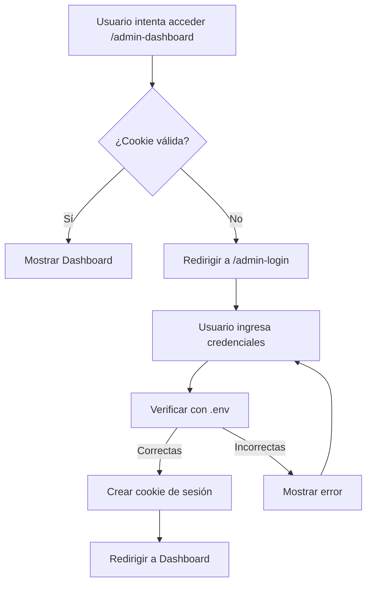

# 🔐 Autenticación del Admin Dashboard

El Admin Dashboard está protegido con autenticación básica usando credenciales almacenadas en el archivo `.env`.

## 📝 Configuración

### 1. Agregar variables de entorno

Agrega estas variables a tu archivo `.env`:

```env
# Admin Dashboard Authentication
ADMIN_USER=admin
ADMIN_PASSWORD=tu_contraseña_segura_aquí
```

### 2. Valores por defecto

Si no configuras estas variables, se usarán los valores por defecto:

- **Usuario**: `admin`
- **Contraseña**: `password`

⚠️ **IMPORTANTE**: Cambia estos valores en producción.

## 🚀 Uso

### Acceder al dashboard

1. Navega a `/admin-dashboard`
2. Serás redirigido a `/admin-login`
3. Ingresa tus credenciales
4. Una vez autenticado, accederás al dashboard

### Cerrar sesión

- Haz clic en el botón **"Salir"** en la esquina superior derecha del dashboard
- La sesión expirará automáticamente después de 7 días

## 🔒 Seguridad

### Cookies de sesión

- **HttpOnly**: Las cookies no son accesibles desde JavaScript
- **Secure**: En producción, solo se envían por HTTPS
- **SameSite**: Protección contra CSRF
- **MaxAge**: 7 días de duración

### Recomendaciones

1. ✅ Usa contraseñas fuertes
2. ✅ Cambia las credenciales por defecto
3. ✅ No compartas tus credenciales
4. ✅ En producción, considera usar un sistema de autenticación más robusto (OAuth, JWT, etc.)

## 📂 Archivos creados

- `/src/routes/admin-dashboard/+page.server.ts` - Middleware de autenticación
- `/src/routes/admin-login/+page.svelte` - Página de login
- `/src/routes/api/admin-login/+server.ts` - API de autenticación
- `/src/routes/api/admin-logout/+server.ts` - API de cierre de sesión

## 🔄 Flujo de autenticación



## 🧪 Pruebas

Para probar la autenticación localmente:

```bash
# 1. Configura tu .env
echo "ADMIN_USER=admin" >> .env
echo "ADMIN_PASSWORD=mipassword123" >> .env

# 2. Inicia el servidor
pnpm dev

# 3. Navega a http://localhost:5173/admin-dashboard
# Serás redirigido al login
```
